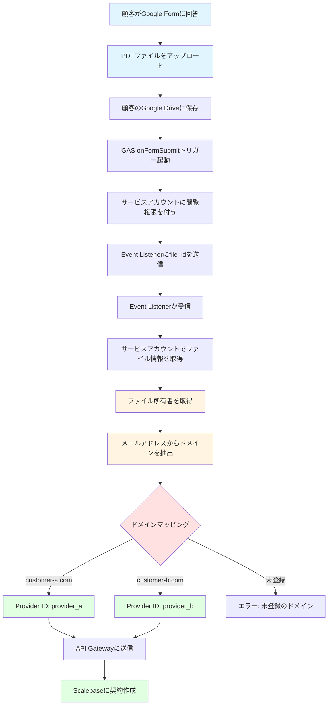
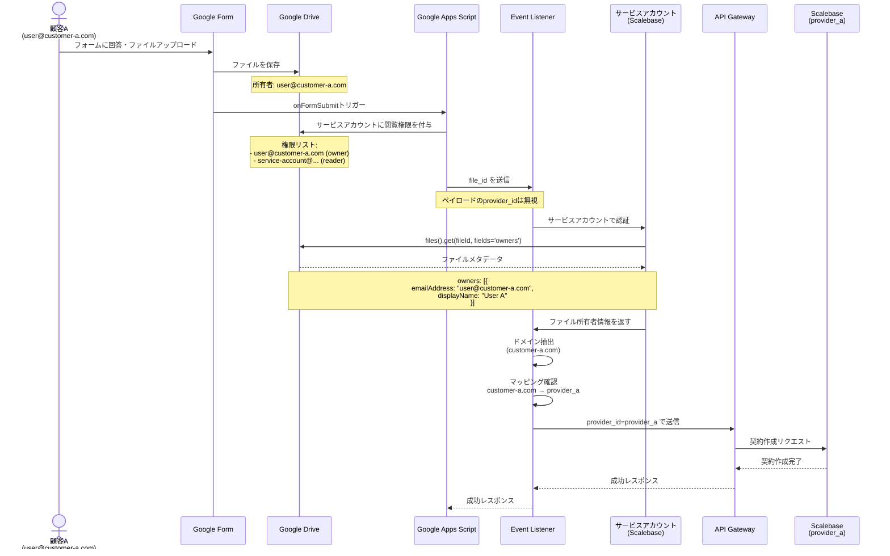
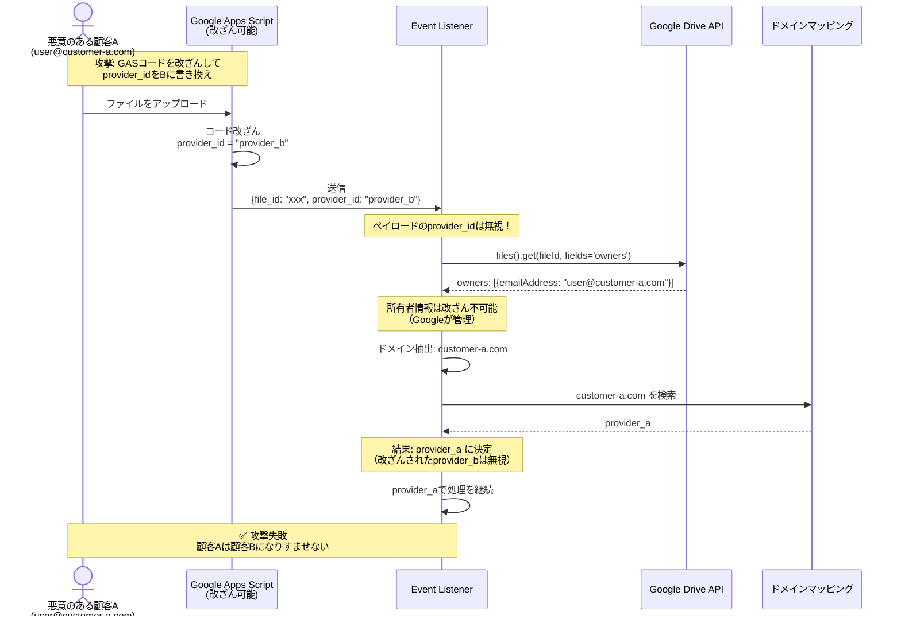
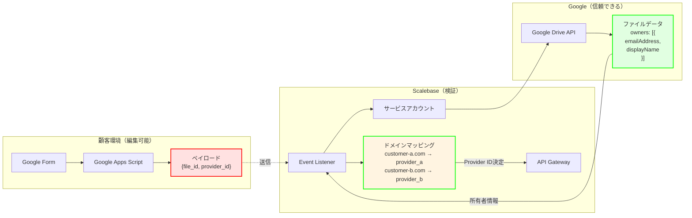
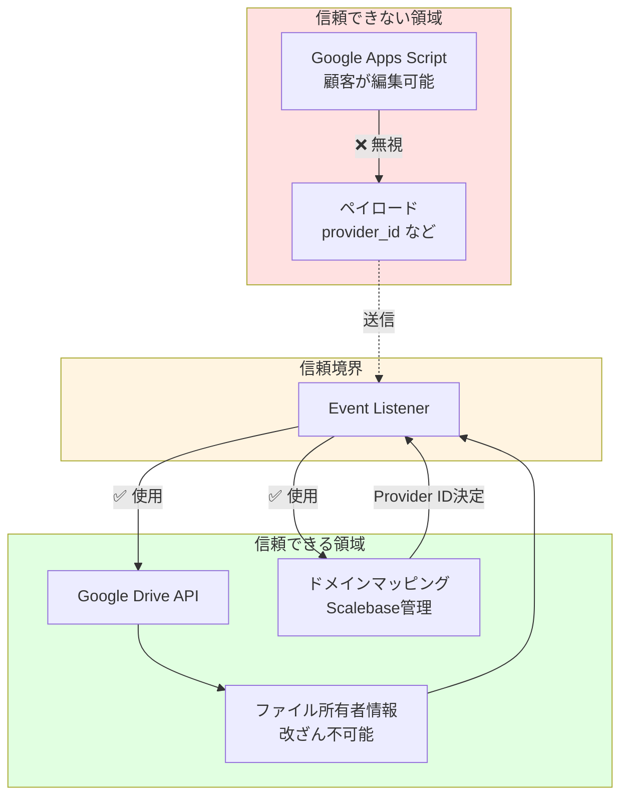

# Google Forms + サービスアカウント認証アーキテクチャ

## 概要

Google Formsでファイルをアップロードした際に、サービスアカウントを使用してファイルの所有者を取得し、所有者のドメインからProvider IDを自動判定する仕組み。

---

## システムフロー図

---

## シーケンス図（正常フロー）

---

## 攻撃シナリオ（改ざん防止）

---

## データフロー図

---

## セキュリティモデル

---

## ドメインマッピングテーブル

| ドメイン | Provider ID | 備考 |
|---------|------------|------|
| customer-a.com | provider_a | 企業ドメイン |
| customer-b.com | provider_b | 企業ドメイン |
| example.com | provider_example | 企業ドメイン |
| gmail.com | ❌ 判定不可 | 個人アカウント |

**個人アカウント（gmail.com）の場合:**
- ドメインベースの判定は不可
- メールアドレス全体でマッピング必要
- 例: `user@gmail.com` → `provider_xxx`

---

## コンポーネント詳細

### 1. Google Apps Script（顧客環境）

**役割:**
- フォーム送信イベントをトリガー
- サービスアカウントに閲覧権限を付与
- Event Listenerにfile_idを送信

**セキュリティ:**
- ❌ 顧客が編集可能
- ❌ ペイロードは信頼できない
- ✅ サービスアカウントへの権限付与は検証可能

### 2. Event Listener（Scalebase）

**役割:**
- file_idを受信
- サービスアカウントでファイル所有者を取得
- ドメインからProvider IDを判定
- API Gatewayに送信

**セキュリティ:**
- ✅ ペイロードのprovider_idは無視
- ✅ Google Drive APIから直接所有者情報を取得
- ✅ ドメインマッピングはScalebase側で管理

### 3. サービスアカウント（Scalebase）

**役割:**
- Google Drive APIにアクセス
- ファイルの所有者情報を取得

**権限:**
- `reader`（閲覧のみ）で十分
- ファイルの編集・削除は不可

### 4. Google Drive API（Google）

**役割:**
- ファイルのメタデータを提供
- 所有者情報を返す

**セキュリティ:**
- ✅ 所有者情報は改ざん不可能
- ✅ Googleが管理

---

## 重要なセキュリティ特性

### ✅ 安全な点

1. **所有者情報は改ざん不可能**
   - Googleが管理
   - GASから変更できない

2. **所有者は必ず1人**
   - 複数の所有者は存在しない
   - 一意に判定可能

3. **ドメインマッピングはScalebase管理**
   - 顧客は変更できない
   - Event Listener側で管理

4. **ペイロードは無視**
   - GASから送信されたprovider_idは使用しない
   - 所有者情報のみを信頼

### ⚠️ 制約

1. **個人アカウント（gmail.com）は判定不可**
   - ドメインが同じため区別できない
   - メールアドレス全体でマッピング必要

2. **権限リストは取得不可**
   - reader権限では403エラー
   - しかし所有者情報だけで判定可能

3. **サービスアカウントへの権限付与が必要**
   - GAS側で必ず実行する必要がある
   - 忘れるとファイルにアクセスできない

---

## まとめ

この仕組みは：
- ✅ 顧客がGASコードを編集しても安全
- ✅ なりすましは不可能
- ✅ Slackと同等のセキュリティレベル
- ✅ シンプルで実装しやすい

**鍵となるポイント:**
ファイルの所有者情報は、Googleが管理する改ざん不可能な情報であり、これを使ってProvider IDを判定することで、顧客が何を送信しても正しいProvider IDに処理される。
