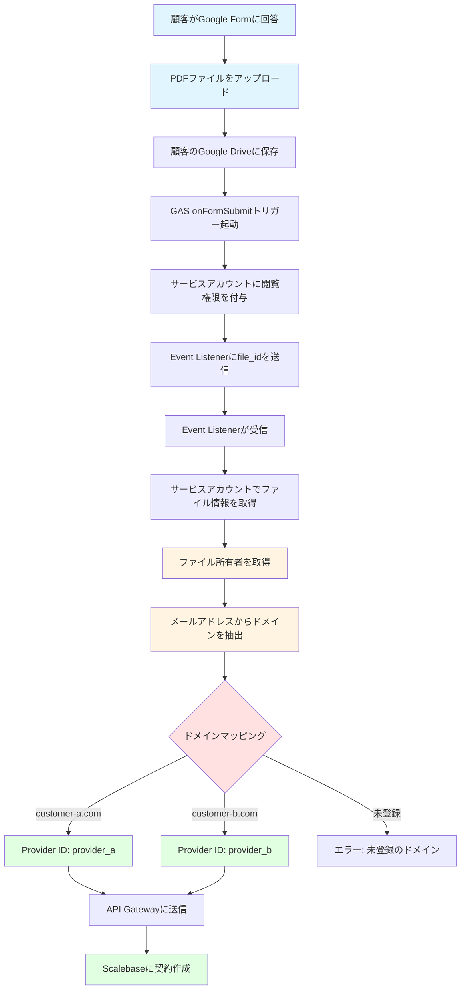
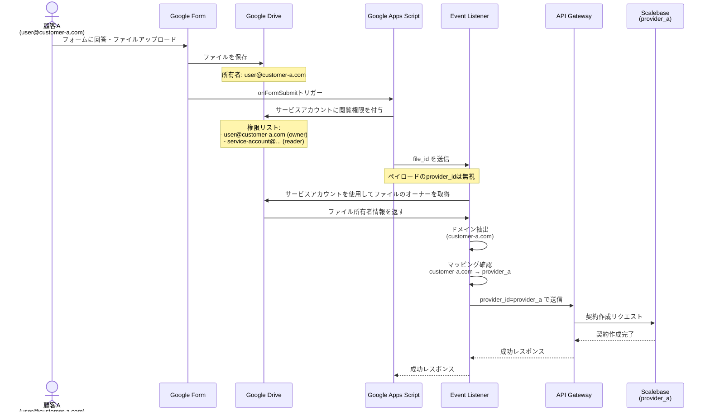

# Google Forms + サービスアカウント認証アーキテクチャ

## 概要

Google Formsでファイルをアップロードした際に、サービスアカウントを使用してファイルの所有者を取得し、所有者のドメインからProvider IDを自動判定する仕組み。

---

## システムフロー図

```mermaid
flowchart TD
    Start[顧客がGoogle Formに回答] --> Upload[PDFファイルをアップロード]
    Upload --> Save[顧客のGoogle Driveに保存]
    Save --> Trigger[GAS onFormSubmitトリガー起動]

    Trigger --> AddPerm[サービスアカウントに閲覧権限を付与]
    AddPerm --> SendEvent[Event Listenerにfile_idを送信]

    SendEvent --> Receive[Event Listenerが受信]
    Receive --> GetFile[サービスアカウントでファイル情報を取得]

    GetFile --> GetOwner[ファイル所有者を取得]
    GetOwner --> ExtractDomain[メールアドレスからドメインを抽出]

    ExtractDomain --> Mapping{ドメインマッピング}

    Mapping -->|customer-a.com| ProviderA[Provider ID: provider_a]
    Mapping -->|customer-b.com| ProviderB[Provider ID: provider_b]
    Mapping -->|未登録| Error[エラー: 未登録のドメイン]

    ProviderA --> CallAPI[API Gatewayに送信]
    ProviderB --> CallAPI

    CallAPI --> CreateContract[Scalebaseに契約作成]

    style Start fill:#e1f5ff
    style Upload fill:#e1f5ff
    style GetOwner fill:#fff4e1
    style ExtractDomain fill:#fff4e1
    style Mapping fill:#ffe1e1
    style ProviderA fill:#e1ffe1
    style ProviderB fill:#e1ffe1
    style CreateContract fill:#e1ffe1
```

---

## シーケンス図（正常フロー）

```mermaid
sequenceDiagram
    actor User as 顧客A<br/>(user@customer-a.com)
    participant Form as Google Form
    participant Drive as Google Drive
    participant GAS as Google Apps Script
    participant EL as Event Listener
    
    participant API as API Gateway
    participant SB as Scalebase<br/>(provider_a)

    User->>Form: フォームに回答・ファイルアップロード
    Form->>Drive: ファイルを保存
    Note over Drive: 所有者: user@customer-a.com

    Form->>GAS: onFormSubmitトリガー
    GAS->>Drive: サービスアカウントに閲覧権限を付与
    Note over Drive: 権限リスト:<br/>- user@customer-a.com (owner)<br/>- service-account@... (reader)

    GAS->>EL: file_id を送信
    Note over GAS,EL: ペイロードのprovider_idは無視

    EL->>Drive: サービスアカウントを使用してファイルのオーナーを取得
    Drive->>EL: ファイル所有者情報を返す

    EL->>EL: ドメイン抽出<br/>(customer-a.com)
    EL->>EL: マッピング確認<br/>customer-a.com → provider_a

    EL->>API: provider_id=provider_a で送信
    API->>SB: 契約作成リクエスト
    SB-->>API: 契約作成完了
    API-->>EL: 成功レスポンス
    EL-->>GAS: 成功レスポンス
```
